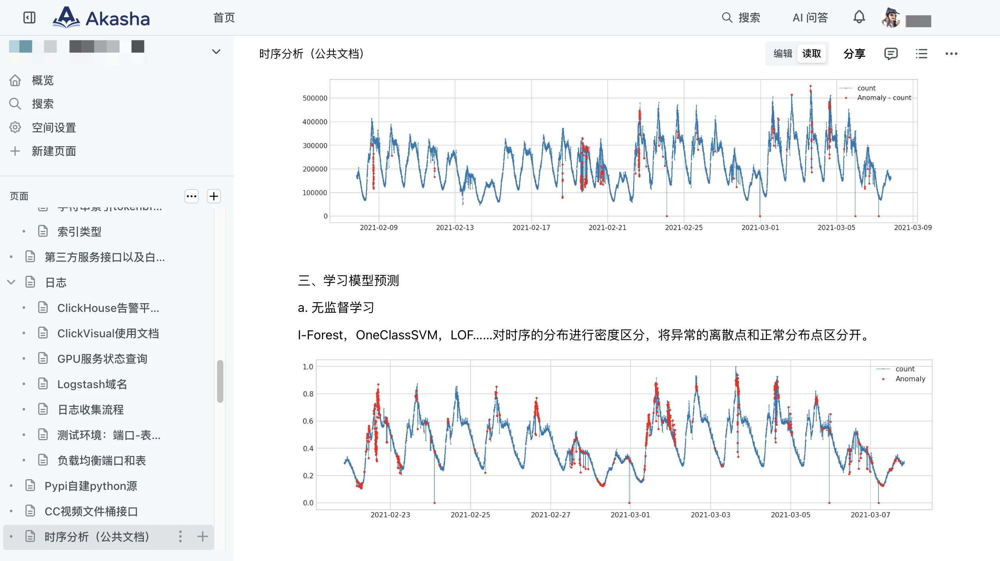
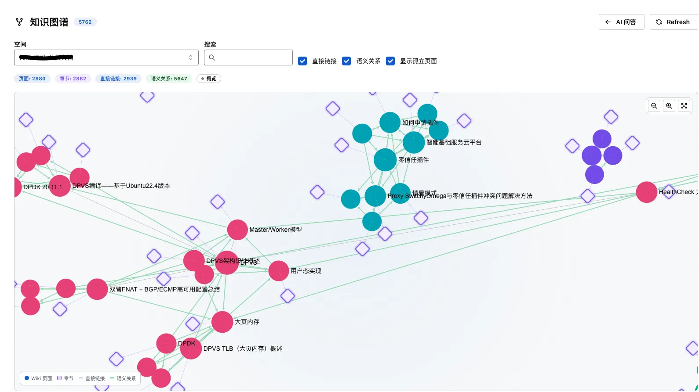

<div align="center">
  <a href="./README.md">English</a> / 中文
</div>
<br>

<p align="center">
  <a href="./LICENSE"></a>
  
  
</p>

<p align="center">
  
  
  
  
</p>

## 目录

- [简介](#简介)
  - [为什么选择 Akasha](#为什么选择-akasha)
  - [核心特性](#核心特性)
  - [核心概念](#核心概念)
    - [知识编译](#知识编译)
    - [有来源依据的知识](#有来源依据的知识)
    - [关系化知识](#关系化知识)
    - [人与 Agent 的统一访问](#人与-agent-的统一访问)
  - [Roadmap / Vision](#roadmap--vision)
    - [超越页面的组织记忆](#超越页面的组织记忆)
    - [Agent 经验复利](#agent-经验复利)
  - [开发](#开发)
    - [安装](#安装)
    - [启动](#启动)
    - [构建](#构建)
  - [Agent 集成](#agent-集成)
  - [私有化部署](#私有化部署)
  - [致谢](#致谢)
  - [贡献者](#贡献者)

# 简介

Akasha 是一个同时面向人类和 Agent 的企业知识与记忆工作区。

它帮助组织把散落在日常工作中的信息和经验，沉淀为可发现、可关联、可复用并且有来源依据的知识。团队可以在共享空间中协作，Agent 则在同一套权限边界内检索和使用组织知识。

Akasha 将协作 Wiki、AI 知识编译与检索、关系导航以及基于 MCP 的 Agent 接入整合在一个支持私有化部署的平台中。





## 为什么选择 Akasha

Akasha 将协作 Wiki 的使用体验，与面向 AI 的知识层结合在一起。

- 🧠 **保持关联的知识** — 页面、空间、附件和编译后的知识通过链接、引用和关系连接起来。

- 🔍 **有来源依据的回答** — AI 检索和问答可以回溯到来源页面及支持证据，避免只返回无法核验的摘要。

- 🤝 **同时服务人类和 Agent** — 人和 Agent 使用同一套知识空间，并遵循同一套工作区权限模型。

- 🕸️ **超越关键词搜索的上下文** — 基于关系的导航帮助用户探索页面、概念、实体和来源之间的联系。

- 🏠 **面向私有化部署设计** — 组织可以在自己的环境中运行 Akasha，并掌控数据、存储和模型接入地址。

## 核心特性

- 📝 **协作知识工作区**

  在共享空间中创建和组织页面，支持富文本编辑、Markdown、附件、评论、版本历史、实时协作和访问控制。

- 🌙 **AI 知识编译**

  将选定的页面和空间加入队列，异步编译为结构化知识产物。任务入队后即开始处理；编译流程可以识别实体、概念、声明、关系、对比、矛盾以及支持证据。

- 🔍 **有来源依据的检索与问答**

  通过全文和向量检索查询组织知识并进行问答。在使用工作区知识回答时，会提供来源页面引用和支持证据，并遵循用户的访问权限。

- 🕸️ **关系图谱**

  通过可视化图谱探索页面链接和语义关系。图谱数据会根据用户权限进行过滤。

- 🤖 **基于 MCP 的 Agent 接入**

  Agent 可以通过 `/mcp` 接入 Akasha，在 API Key 和权限控制下查询知识，并对页面、空间、评论、附件和工作区信息执行允许的操作。

## 核心概念

### 知识编译

Akasha 将 Wiki 页面和导入内容保留为来源层，并在此基础上构建结构化知识层。

知识编译流程会分析来源内容，生成摘要、实体、概念、声明、关系、对比和矛盾等知识产物。每个知识产物都会保留来源引用和支持证据，使编译后的知识可以回溯到原始内容。

```text
Wiki 页面 / 导入内容
          ↓
      知识编译
          ↓
结构化产物 + 证据 + 索引
          ↓
检索 / 问答 / 图谱导航
```

知识编译是对原始 Wiki 的增强，而不是替代。来源页面仍然用于阅读、编辑、权限校验和引用。

### 有来源依据的知识

Akasha 将来源内容与派生知识区分开来。

原始 Wiki 页面和导入内容是主要来源。编译后的知识产物和 AI 回答都来源于这些内容，并在可能的情况下保留引用、来源页面或支持证据。

这使系统能够：

- 将编译后的声明追溯到来源页面；
- 查看回答背后的支持证据；
- 在检索时遵循来源页面的访问权限；
- 在来源发生变化后识别需要更新的知识。

当现有证据不足时，系统可以明确提示这一限制，而不是把缺乏依据的结论当作事实。

### 关系化知识

Akasha 不把知识看作彼此孤立的页面集合。

知识层会记录页面之间的直接链接，以及知识编译阶段发现的语义关系。这些关系连接页面、章节、实体、概念和共享来源，帮助用户探索相关上下文，并在知识空间中进行关联导航。

关系图谱用于辅助发现和检索，不替代原始来源页面。图谱结果会根据用户的访问权限进行过滤。

### 人与 Agent 的统一访问

Akasha 同时面向人类用户和 Agent 设计。

人类用户通过 Wiki 界面创建、编辑、组织和讨论知识。Agent 则通过 MCP 查询知识，并对页面、空间、评论、附件和工作区信息执行允许的操作。

两种访问方式都遵循工作区和资源级别的权限控制。Agent 请求使用 API Key 认证，支持的知识查询和操作会记录到审计日志中。

## Roadmap / Vision

以下内容代表 Akasha 的产品方向，属于探索中的规划，不应视为当前版本已经提供或保证提供的功能清单。

### 超越页面的组织记忆

Akasha 计划从知识工作区进一步发展为更完整的组织记忆系统：

- **事实记忆** — 记录发生了什么，并保留来源产物和出处；
- **交互记忆** — 记录决策、分歧和取舍为什么重要；
- **行动记忆** — 记录接下来应该采取哪些行动、工作流和防护措施。

### Agent 经验复利

未来可能支持将可复用的 Agent Skills、操作模式和执行反馈积累到组织层面，让组织经验能够在不同任务和 Agent 之间持续复用。

## 开发

### 安装

```bash
git clone https://github.com/chaterm/Akasha.git
cd Akasha
pnpm install
```

这是一个 pnpm workspace monorepo。依赖安装和项目脚本都请使用 `pnpm`。

创建本地环境变量文件：

```bash
cp .env.example .env
```

生成本地应用密钥，并将结果写入 `.env` 中的 `APP_SECRET`：

```bash
openssl rand -hex 32
```

不要将 `.env` 或生产环境凭证提交到仓库。

### 启动

使用仓库提供的 Compose 服务启动带 pgvector 的 PostgreSQL，并单独提供 Redis：

```bash
docker compose up -d db
docker run -d --name akasha-redis -p 6379:6379 redis:7
```

然后执行数据库迁移并启动开发服务器：

```bash
pnpm --filter ./apps/server run migration:latest
pnpm run dev
```

打开 [http://localhost:3000](http://localhost:3000)。环境要求、模型配置、服务详情和故障排查请参阅 [`docs/development.md`](./docs/development.md)。

### 构建

```bash
pnpm run build           # 构建所有 workspace 项目
pnpm run client:build    # 仅构建前端
pnpm run server:build    # 仅构建后端
```

构建产物会生成在对应的 `apps/*/dist` 和 `packages/*/dist` 目录中。

## Agent 集成

Akasha 提供 MCP 接口，供 Agent 访问知识工作区。

配置 MCP Server 时需要提供：

- 部署后的 Akasha 实例绝对地址，并在末尾加上 `/mcp`；
- 具有相应工作区权限的 API Key。

MCP 集成支持知识查询，以及对页面、空间、评论、附件和工作区信息执行权限范围内的操作。所有请求都会遵循 Akasha 的授权规则。

安装方式和不同 Agent 宿主的配置示例，请参阅 [`akasha-plugin/README.md`](./akasha-plugin/README.md)。

## 私有化部署

Akasha 面向私有化环境设计。组织可以自行控制应用数据、文件存储和 AI 模型接入地址，并根据自身要求配置访问控制和运行策略。

## 致谢

Akasha 建立在优秀的开源项目之上，在此致谢：

- **[Docmost](https://github.com/docmost/docmost)** — 工作区与编辑器层所基于的协作 Wiki 基础。

## 贡献者

感谢每一位贡献者！
更多信息请参阅[贡献指南](./CONTRIBUTING.md)。
